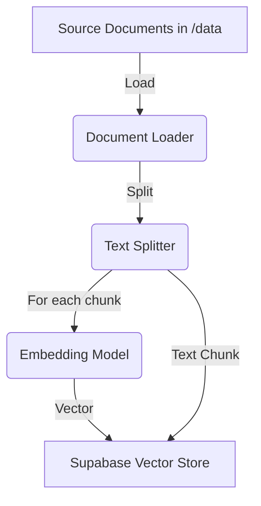
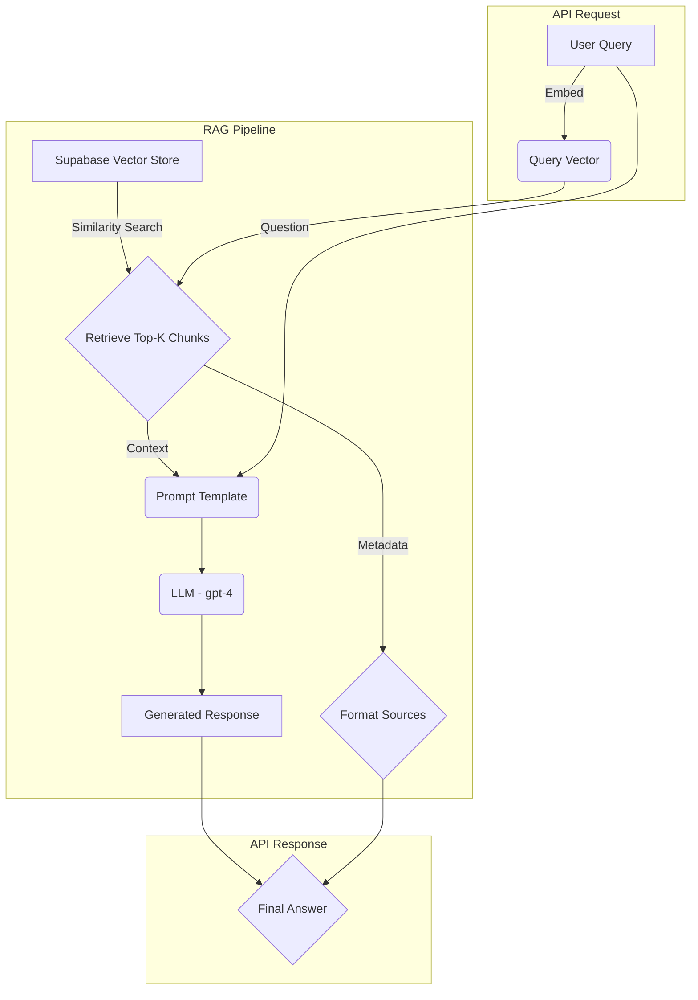

# RAG Pipeline Design v1

This document outlines the architecture of the version 1 Retrieval-Augmented Generation (RAG) pipeline.

## 1. Overview

The RAG pipeline enhances the language model's responses by providing it with relevant, up-to-date information from a private knowledge base. This ensures that the AI's answers are grounded in factual data and can include specific details from the provided documents.

## 2. Architecture

The pipeline consists of two main stages: **Indexing** and **Retrieval & Generation**.

### 2.1. Indexing Stage (Offline)

This stage processes the source documents and prepares them for efficient retrieval.

1.  **Load Documents:** Source documents (e.g., `.txt`, `.md`, `.pdf`) are loaded from the `/data` directory.
2.  **Split Text:** The loaded documents are split into smaller, semantically meaningful chunks.
3.  **Create Embeddings:** Each chunk is passed to an embedding model (e.g., OpenAI's `text-embedding-ada-002`) which converts the text into a numerical vector representation.
4.  **Store in Vector Database:** The text chunks and their corresponding embeddings are stored in **Supabase Vector Store** using the `pgvector` extension.

### 2.2. Retrieval & Generation Stage (Online)

This stage is executed in real-time when a user submits a query.

1.  **Receive Query:** The user's query is received at the `/rag/query` API endpoint.
2.  **Embed Query:** The query is converted into an embedding vector using the same model as in the indexing stage.
3.  **Similarity Search:** The query vector is used to perform a similarity search against the vectors in the **Supabase Vector Store**. The top-k most similar document chunks are retrieved.
4.  **Create Prompt:** A detailed prompt is constructed, combining the user's original query with the content of the retrieved document chunks.
5.  **Generate Response:** The combined prompt is sent to a powerful language model (e.g., OpenAI's `gpt-4`). The model generates a comprehensive answer based on the provided context.
6.  **Include Sources:** The response includes information about the source documents (e.g., file name, page number) to ensure transparency and allow for verification.

## 3. Key Components (v1)

-   **Framework:** LangChain
-   **Document Loader:** `UnstructuredMarkdownLoader` for text files.
-   **Text Splitter:** `RecursiveCharacterTextSplitter`.
-   **Embedding Model:** OpenAI `text-embedding-ada-002`.
-   **Vector Store:** `SupabaseVectorStore` (using pgvector).
-   **LLM:** OpenAI `gpt-4` (or similar).
