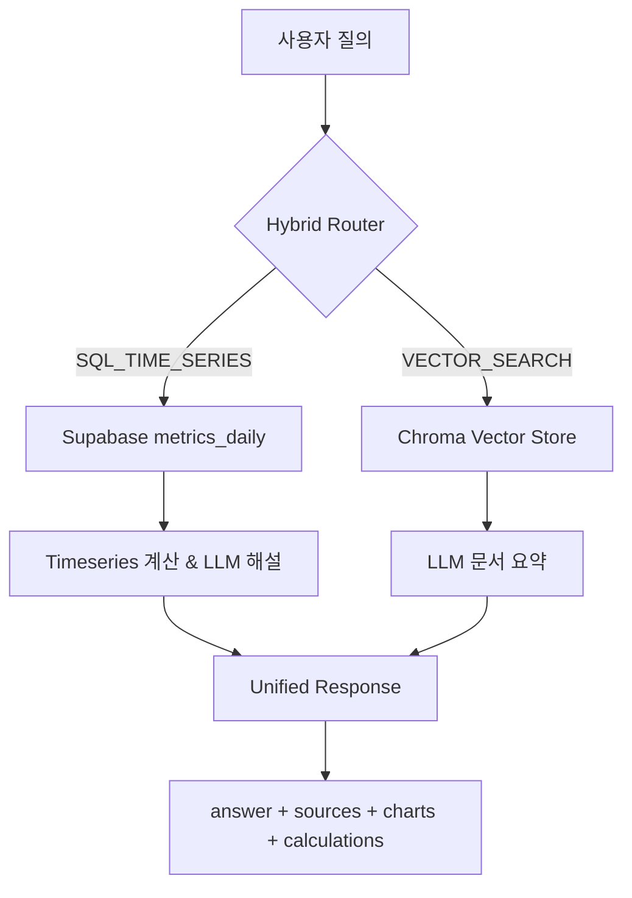

# Hybrid RAG Architecture (v2)

## 1. Overview
The FoodBiz AI assistant now combines two retrieval strategies:

1. **Document Vector Search** — for policy, 가이드, 리뷰 요약 등 텍스트 기반 질문.
2. **Real-time SQL Timeseries** — for 매출/추이 등 수치형 의도. Supabase `public.metrics_daily` 테이블을 직접 조회합니다.

A lightweight router inspects the 사용자 쿼리. 키워드(매출·추이·전주 등)가 감지되면 SQL 경로, 그렇지 않으면 벡터 검색이 선택됩니다. 모든 응답은 공통 스키마를 준수합니다.



## 2. Document Indexing
```
File location: docs/policies/**/*.{md,txt,pdf}
Persist directory: data/chroma
Splitter: RecursiveCharacterTextSplitter (chunk 1000 / overlap 150)
Embeddings: OpenAI (model configurable via RAG_EMBEDDING_MODEL)
Vector store: Chroma (disk persistence)
```
`POST /rag/index` rebuilds the index. Each Document chunk stores `source` 경로와 `uploaded_at` ISO timestamp.

## 3. Vector Retrieval & Generation
1. `vector_search(query, top_k)` loads the persisted Chroma store.
2. 상위 k개의 문서 chunk 내용을 컨텍스트로 구성.
3. `ChatOpenAI`에 시스템 메시지 + 컨텍스트 전달 → 한국어 해설 생성.
4. 응답에는 문서 출처(`type: doc`)와 메타데이터가 포함됩니다.

## 4. SQL Timeseries Path
1. `fetch_timeseries(business_id, from, to)`가 `public.metrics_daily`에서 범위 데이터를 조회합니다.
2. 결과를 `{x: ISO date, y: net_sales}` 시리즈로 정규화하고 7일 이동평균/증감률을 계산합니다.
3. 추가로 `public.reviews` 요약과 `policy_products` 추천 목록을 수집하여 LLM 컨텍스트에 포함합니다.
4. `llm_explain_timeseries`가 수치형 데이터와 부가 정보를 한국어로 요약합니다 (LLM 실패 시 규칙 기반 문구).
5. 차트(`type: timeseries`), 계산 결과, 관련 SQL 출처가 응답에 포함됩니다.

## 5. Unified Response Schema
```jsonc
{
  "answer": "…LLM 해설…",
  "sources": [
    { "type": "sql", "name": "public.metrics_daily", "meta": {"from": "2025-01-01", "to": "2025-01-30"} },
    { "type": "doc", "name": "docs/policies/eligibility.md", "meta": {"uploaded_at": "2025-02-01T02:13:00"} }
  ],
  "charts": [
    { "type": "timeseries", "series": [{ "name": "매출", "data": [{"x": "2025-01-01", "y": 432100 }, … ] }] }
  ],
  "calculations": { "moving_avg_7": 418400.0, "pct_change_7d": -0.12 }
}
```
모든 경로에서 동일한 스키마가 유지되므로 프런트엔드와 WebSocket은 단일 렌더러로 처리할 수 있습니다.

## 6. Logging & Monitoring
- JSON 로그 필드: `router_decision`, `top_k`, `sql_range`, `latency_ms`, `biz_id_hash`, `error_code`.
- WebSocket 연결/해제 이벤트, SSE 종료 이벤트도 구조화 로그로 기록합니다.
- 로그에는 PII와 원문 카드번호 등은 포함되지 않습니다 (business id는 SHA-256 hash 12자 사용).

## 7. Fallbacks
- 벡터 검색에서 문서를 찾지 못하면 LLM이 일반 답변을 제공하고 SQL 제안 메타(`suggested_range`)를 첨부합니다.
- SQL 경로에서 데이터가 비어 있으면 차트는 생략되고 안내 문구가 반환됩니다.
