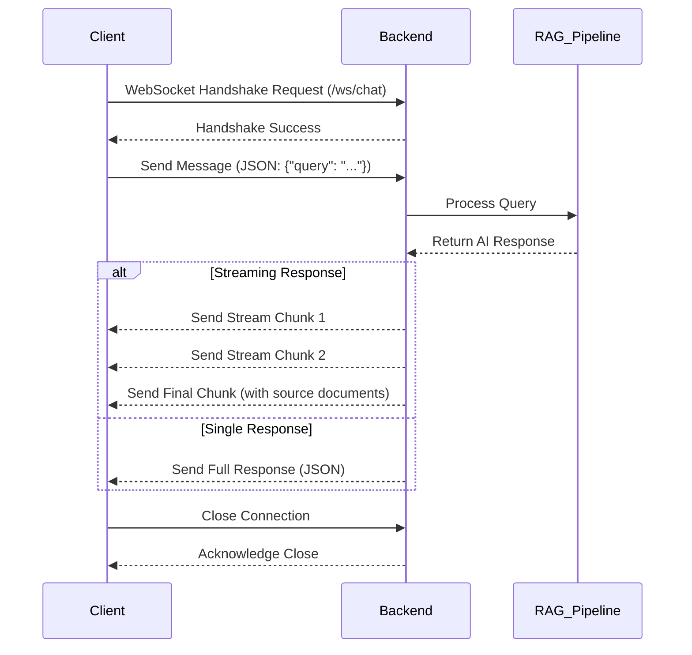

# Phase 4: Realtime Chat Flow

## 1. Overview

This document outlines the flow of the real-time chat functionality, which is based on WebSockets. It details the connection lifecycle, message structure, and error handling strategies.

## 2. Sequence Diagram



## 3. Message Contracts

### Client to Server
- **Type**: `query`
- **Payload**:
  ```json
  {
    "query": "사용자가 입력한 질문입니다."
  }
  ```

### Server to Client
- **Type**: `stream_chunk`
- **Payload**:
  ```json
  {
    "type": "chunk",
    "content": "AI가 생성 중인 답변의 일부입니다."
  }
  ```
- **Type**: `final_response`
- **Payload**:
  ```json
  {
    "type": "final",
    "response": "AI의 최종 답변입니다.",
    "sources": [
      {
        "source_name": "출처 문서 1.md",
        "snippet": "답변의 근거가 되는 문서의 일부입니다."
      }
    ]
  }
  ```

## 4. Error Handling

- **Connection Error**: The client will attempt to reconnect with an exponential backoff strategy (e.g., 1s, 2s, 4s, ...).
- **Authentication Error**: If the WebSocket connection fails due to an invalid token, the client will be redirected to the login page.
- **Message Processing Error**: The server will send an error message to the client and log the issue.
  ```json
  {
    "type": "error",
    "detail": "An error occurred while processing your message."
  }
  ```
